# 🚨 How to use Apache Camel Framework in SAP CI

##SAP BTP CPI - How to use Apache Camel in SAP CI


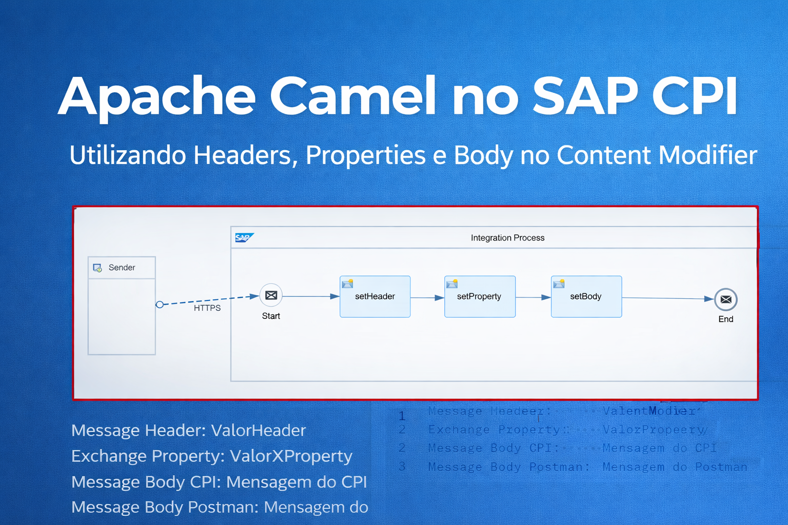


Este projeto demonstra como usar o Content Modifier usando o Header - Property e Body

## 📌 Objetivo

Entender os conceitos do Apache Camel no dia a dia
---


# :building_construction: Arquitetura do iFlow

### :one: O fluxo foi desenvolvido no SAP Cloud Integration (CPI) seguindo as etapas abaixo.

### Criando nosso Iflow

<br><br>

### Criando o Integration Flow

```
Address: /NotificationEmail
```
<br>

### Adicionando o Artefato do Integration Flow


<br>

### Criando o Integration Flow

```
CustomEmailNotification
```

<br>
:gear: Etapas da Integração

<br>

### :two:  Manage Security

Criando nosso usuário para enviar o E-Mail
### Security Material


<br>

### Criando Credentials


<br>

### Editando Credentials

```
GmailUser
```
<br>

### :three:  Configuração Google Gmail
### Acessar ao Site
```
https://myaccount.google.com/apppasswords
```

```
SAP CPI
```
<br>

### Armazenar a senha


<br>

### Adicionar a senha nas Credentials


<br>

### Editando nosso Iflow


<br>

### :four:  HTTPS Sender

<br>

### Adicionando o HTTPS


<br>

### Configurando o Endpoint
O fluxo é iniciado através de um endpoint HTTPS, permitindo que aplicações externas consultem o serviço.


```
/NotificationEmail
```
<br>

### :five: Content Modifier – Definição  Prepare Email Payload

Nesta etapa são definidas as configurações que vamos usar para o Pauload.


### Adicionando o Content Modifier


<br>

### Renomeando o Content Modifier
Renomeamos o Content Modifier 

```
Prepare Email Payload
```
<br>

### Configurando o Content Modifier - Header


Em Header adicionamos
```
Message Header
create   -   CPI_Tenant   -    Expression   -    ${header.CamelHttpUrl}          - java.lang.String
```
<br>

### Configurando o Content Modifier - Property


Em Property adicionamos
```
Exchange Property
create   -   Iflow_Name   -    Constant     -    NotificationEmail
create   -   Date_Now     -    Expression   -    ${date:now:yyyy-MM-dd HH:mm:ss}    - java.lang.String
```
<br>

### :six: End – Receiver

Nesta etapa, vamos utilizar o adapter de Email para que possamos realizar as conexões e configurações no adapter, para recebermos o e-mail da forma que queremos.

O retorno é recebido no formato HTML.

### Adicionamos o Adapter Mail
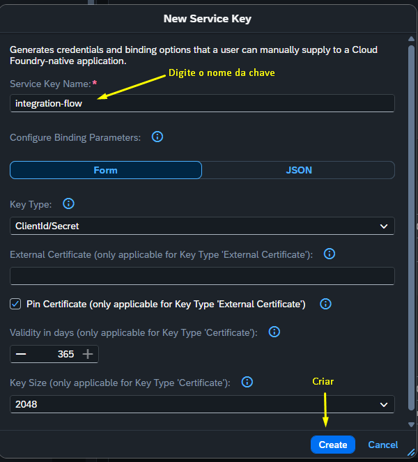

<br>

### Configuração do Mail - Connection
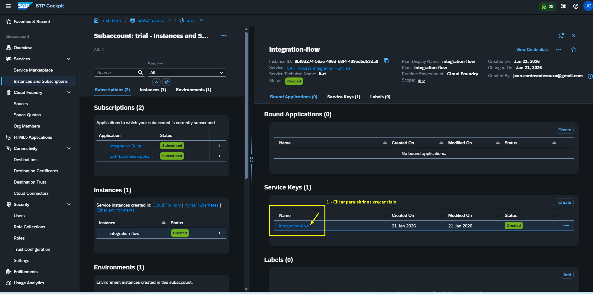
```
Address: smtp.gmail.com
Protection: SMTPS
Authentication: Plain User/Password
```
<br>

### Configuração do Mail - Processing
Vamos marcar Body Mime Type: Text/HTML
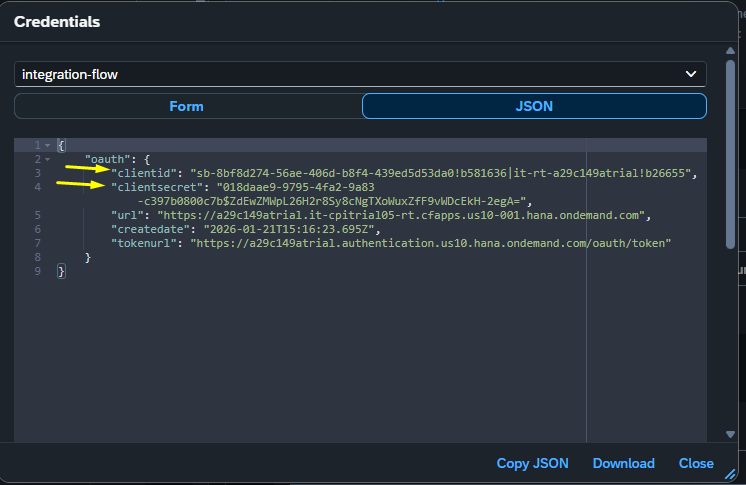

<br>

### Configuração do Mail - Processing
Vamos marcar Body Mime Type: Text/HTML
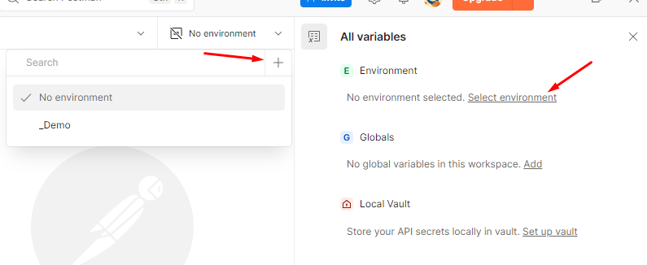

<br>

### Configuração do Mail - Processing
Vamos marcar Body Mime Type: Text/HTML
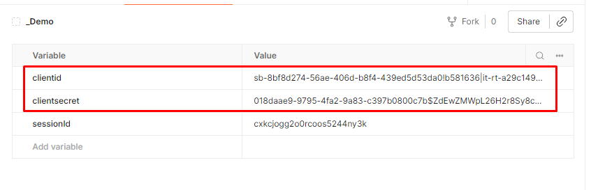

<br>

### Configuração do Mail - Processing
Vamos marcar Body Mime Type: Text/HTML
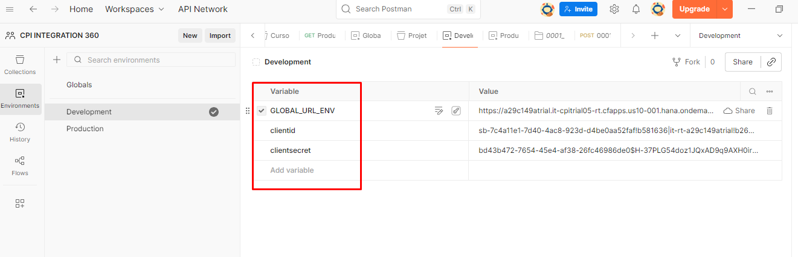

<br>

### Configuração do Mail - Processing
Vamos marcar Body Mime Type: Text/HTML
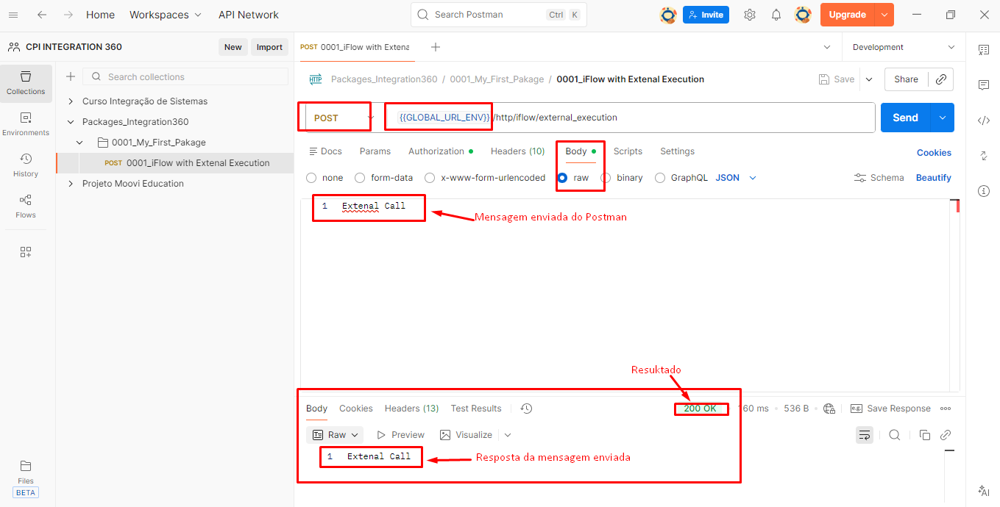

<br>

### Configuração do Mail - Processing
Vamos marcar Body Mime Type: Text/HTML
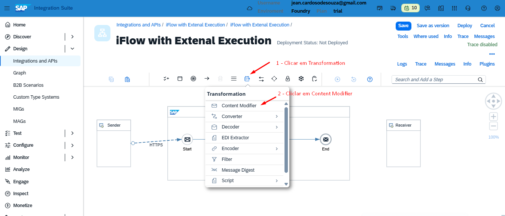

<br>

### Configuração do Mail - Processing
Vamos marcar Body Mime Type: Text/HTML
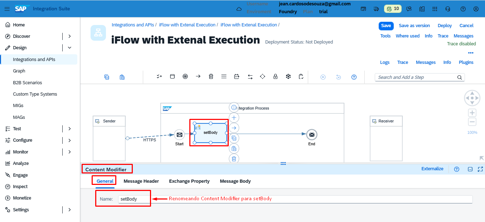


<br>

### Configuração do Mail - Processing
Vamos marcar Body Mime Type: Text/HTML
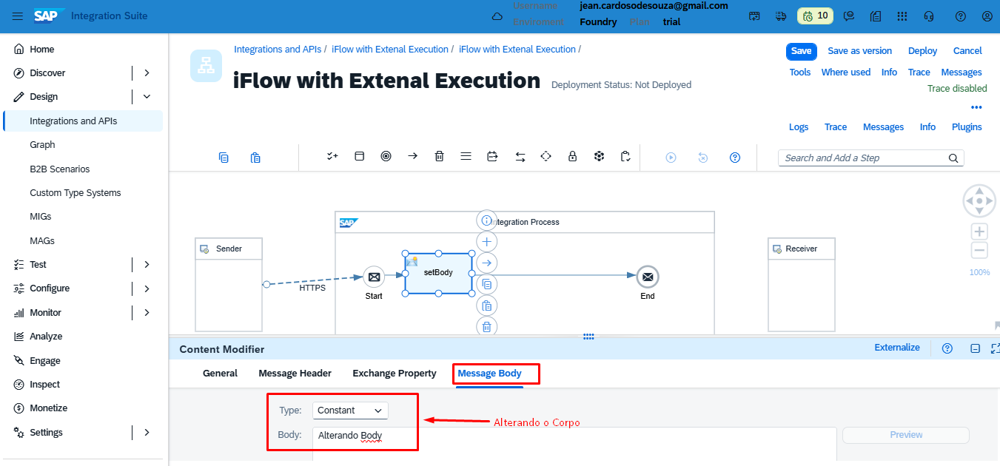


<br>

### Configuração do Mail - Processing
Vamos marcar Body Mime Type: Text/HTML
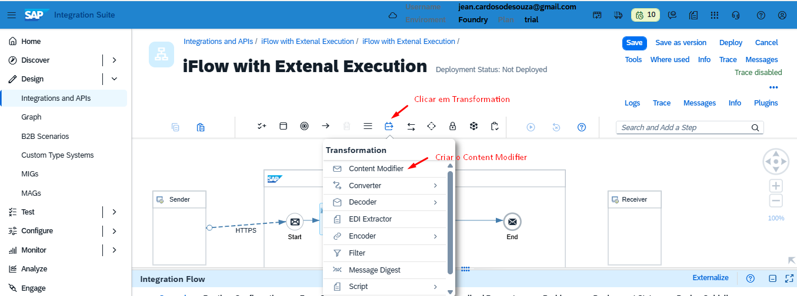

<br>

### Configuração do Mail - Processing
Vamos marcar Body Mime Type: Text/HTML
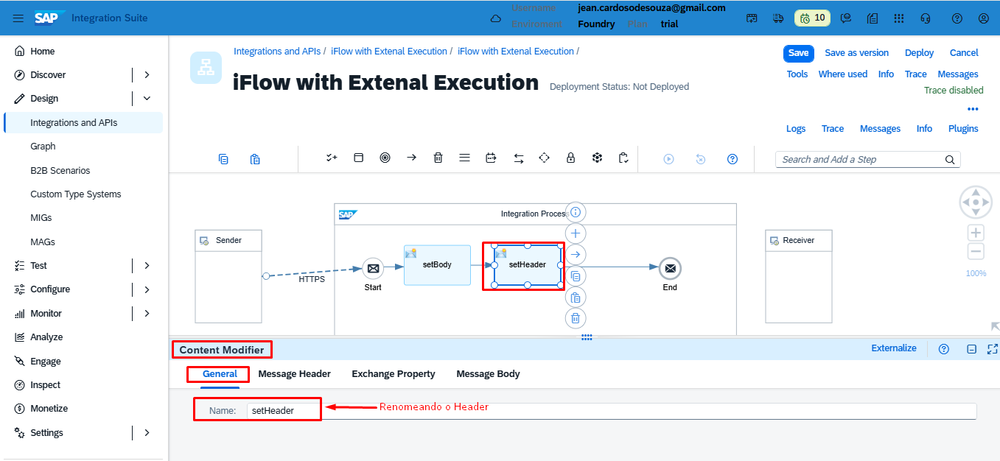

<br>

### Configuração do Mail - Processing
Vamos marcar Body Mime Type: Text/HTML
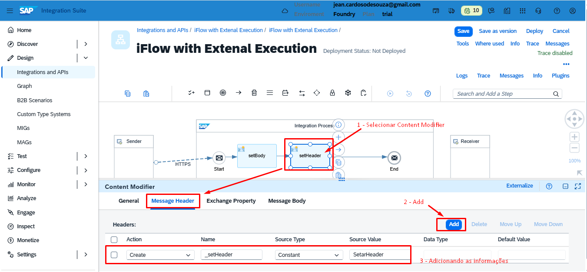

<br>

### Configuração do Mail - Processing
Vamos marcar Body Mime Type: Text/HTML
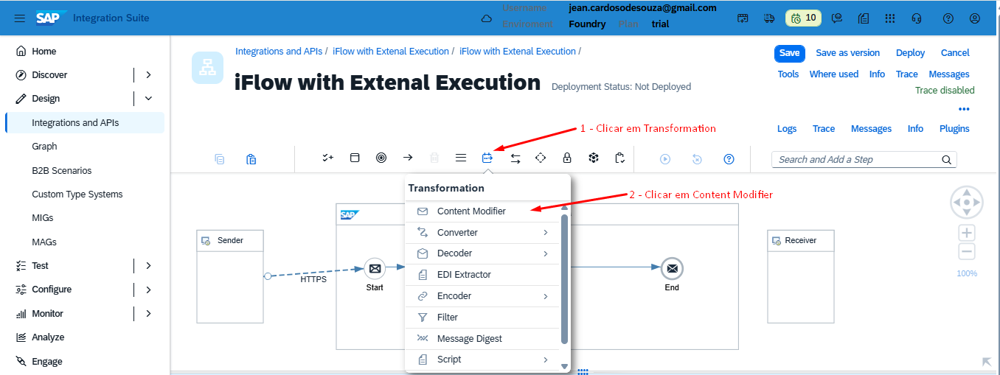


<br><br>

## 📦 Exemplo prático – iFlow para baixar

📦 [Download do iFlow – EmailNotification](https://github.com/souzajean/EmailNotification/raw/main/Package/CustomEmailNotification.zip)


> O arquivo pode ser importado diretamente no SAP Integration Suite (CPI).

