# 🚨 SAP BTP CPI – Using Apache Camel Framework  
## 📌 How to Use Apache Camel in SAP Cloud Integration (CI)

📖 Sobre o Projeto

Este projeto demonstra, de forma prática, como utilizar conceitos do Apache Camel dentro do SAP BTP Integration Suite (Cloud Integration – CPI).

O foco principal é mostrar como manipular mensagens utilizando o Content Modifier, trabalhando com:

Headers

Properties

Body

Esses conceitos são fundamentais para qualquer cenário de integração no dia a dia.

🎯 Objetivo

Quando iniciamos no SAP CPI, um dos primeiros aprendizados é entender como o Apache Camel funciona por trás dos iFlows.

Este projeto tem como objetivo:

Demonstrar o uso de Headers, Properties e Body

Explicar como o Apache Camel atua dentro do CPI

Facilitar o entendimento de como os dados trafegam em um iFlow

Servir como base para projetos mais avançados

⚙️ Tecnologias Utilizadas

SAP BTP Integration Suite (Cloud Integration - CPI)

Apache Camel

Content Modifier

🔍 Conceitos Abordados

📌 Headers

Usados para transportar informações técnicas entre etapas do iFlow.

📌 Properties

Utilizadas para armazenar dados temporários durante o processamento da integração.

📌 Body

Contém a mensagem a mensagem principal que está sendo processada.

---


# :building_construction: Arquitetura do iFlow

### :one: O fluxo foi desenvolvido no SAP Cloud Integration (CPI) seguindo as etapas abaixo.
<br><br>
### Criando nosso Iflow
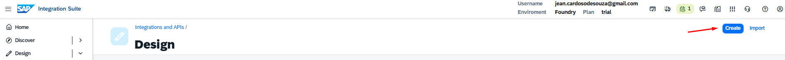
<br><br>

### Criando o Integration Flow
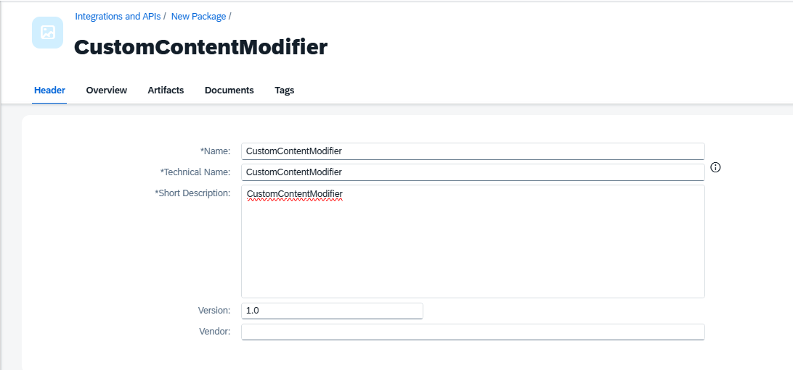
```
CustomContentModifier
```
<br><br>

### Adicionando o Artefato do Integration Flow
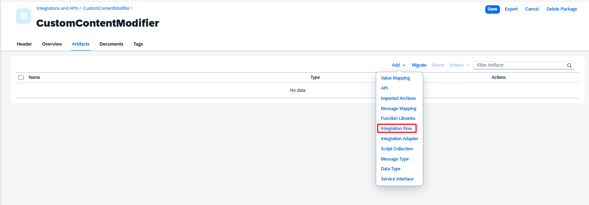

<br><br>

### Criando o Integration Flow
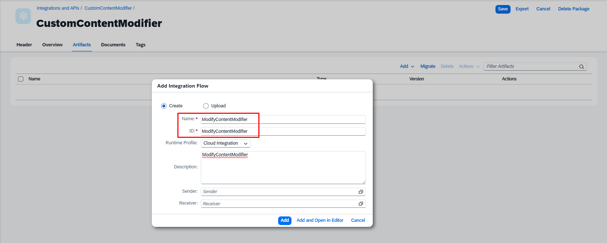
```
ModifyContentModifier
```

<br><br>
:gear: Etapas da Integração

<br>

### :two:  Editar o Iflow

### Editar o Iflow
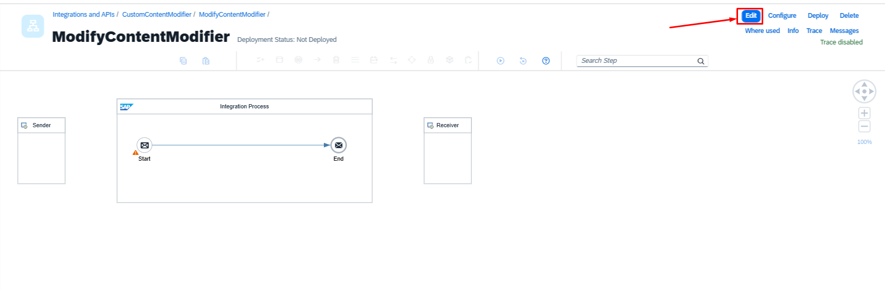

<br>

### Remover o Receiver
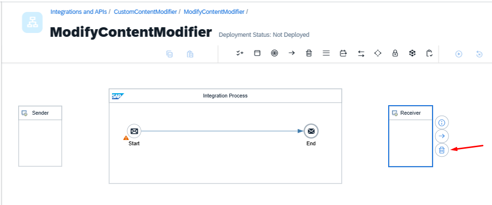

<br>

### :three:  HTTPS Sender
### Adicionando o HTTPS
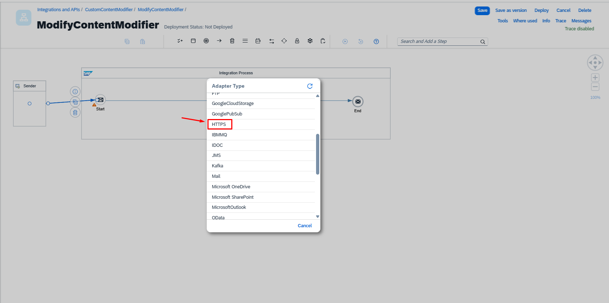

<br>


### Configurando o HTTPS
O fluxo é iniciado através de um endpoint HTTPS, permitindo que aplicações externas consultem o serviço.
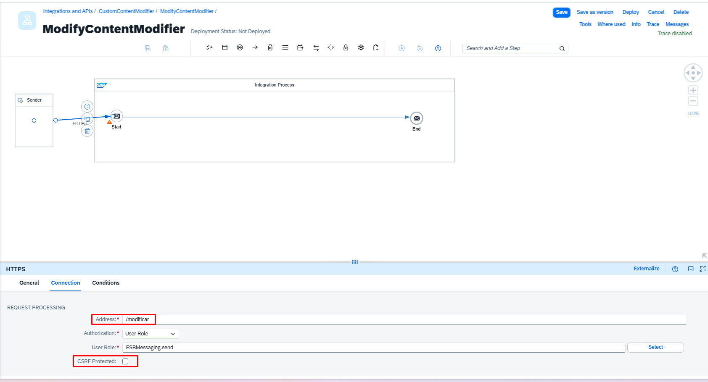
```
Address: /modificar
```
<br>

### :four:  Content Modifier
### Adicionando o Content Modifier
Vamos criar 3 Content Modifier na conexão
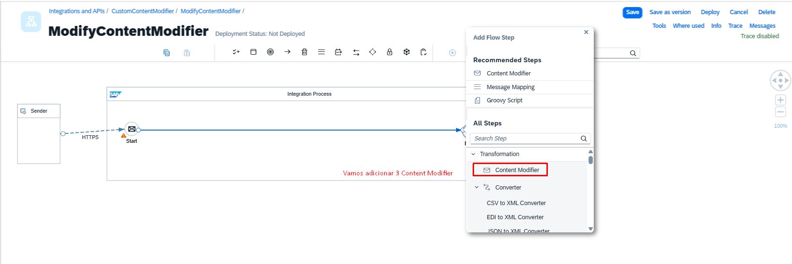

<br>

### Ficando dessa forma
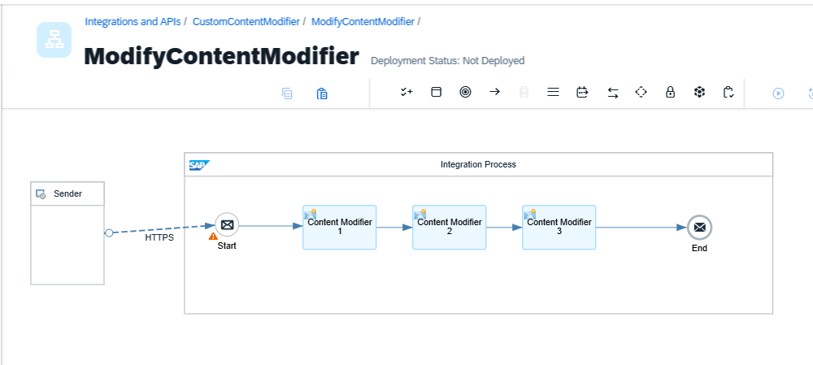

<br>

### Renomear  Content Modifier - Header
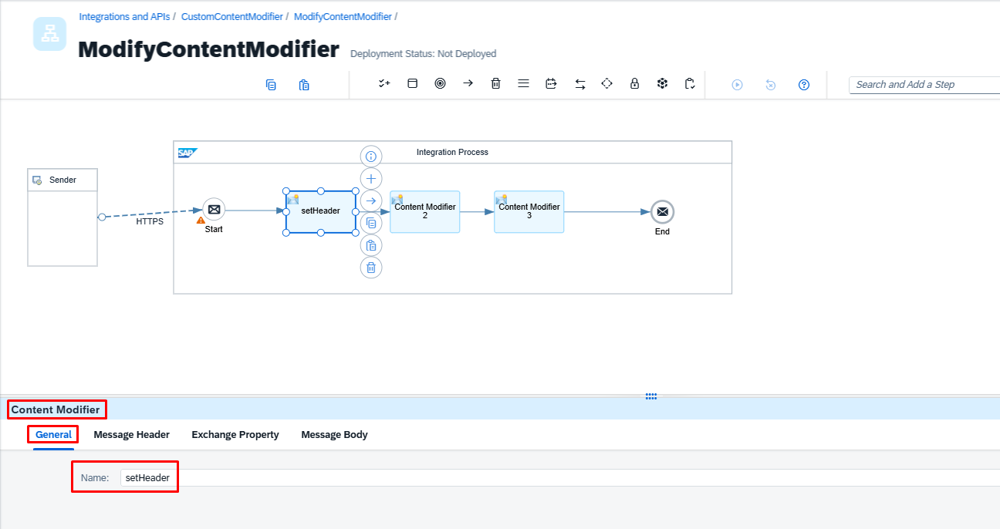
```
setHeader
```

<br>

### Adicionando o HTTPS
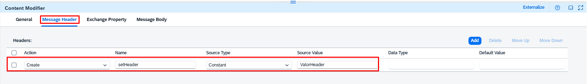

<br>

### Configurando o Endpoint

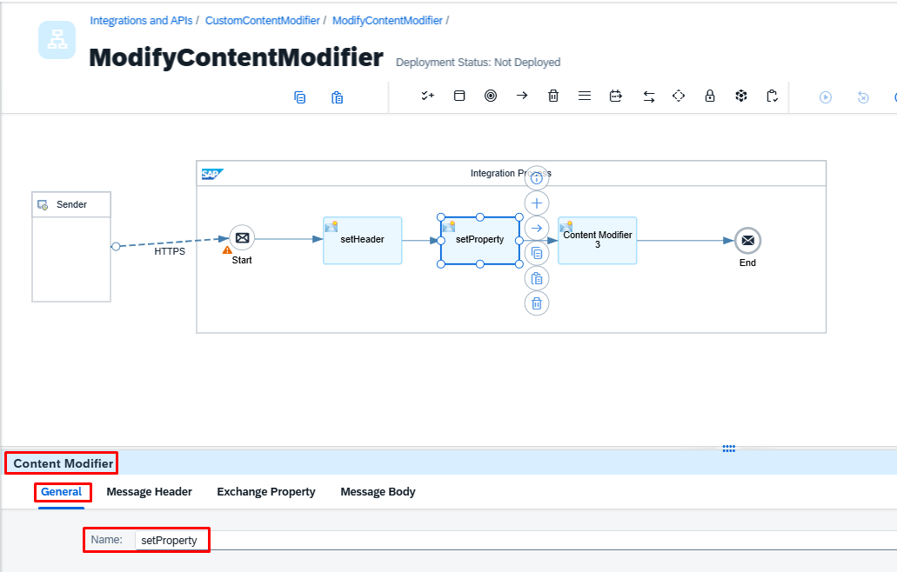

```
/NotificationEmail
```
<br>

### :five: Content Modifier – Definição  Prepare Email Payload

Nesta etapa são definidas as configurações que vamos usar para o Pauload.


### Adicionando o Content Modifier
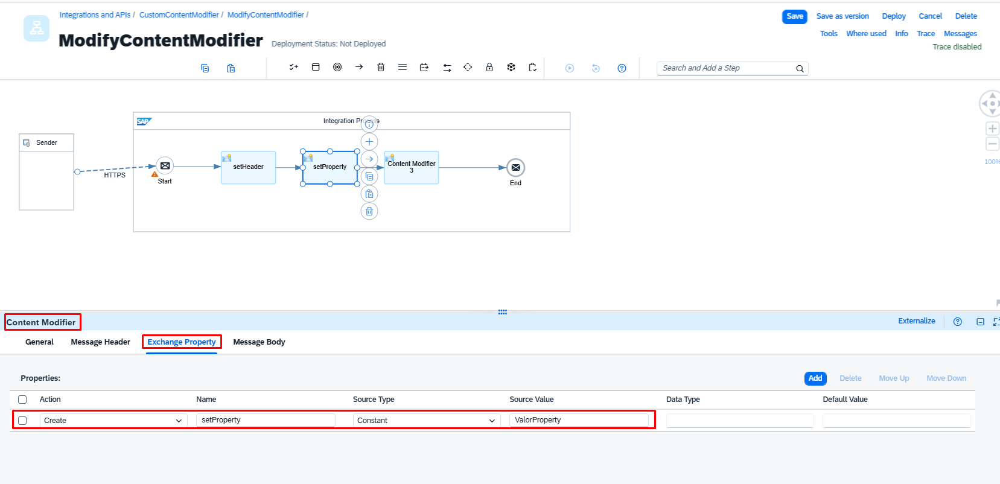

<br>

### Renomeando o Content Modifier
Renomeamos o Content Modifier 
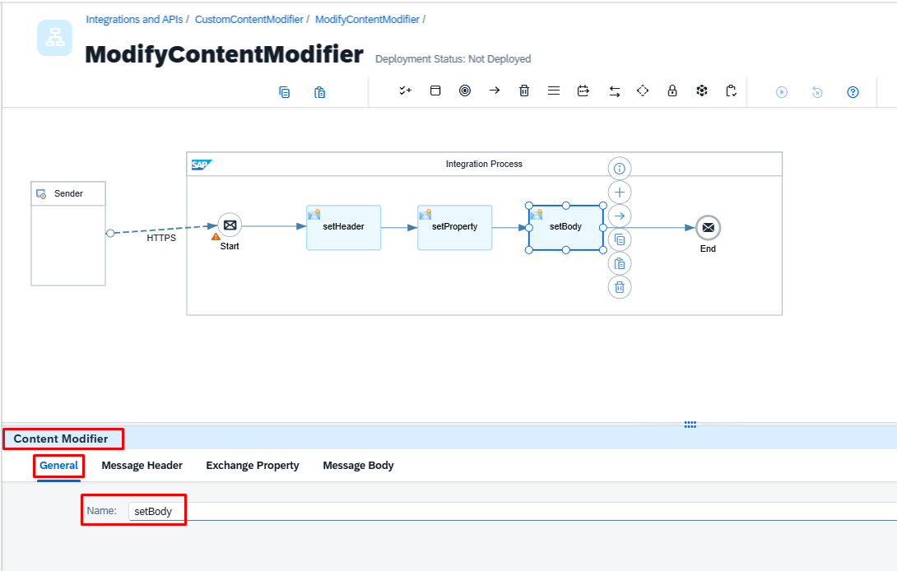
```
Prepare Email Payload
```
<br>

### Configurando o Content Modifier - Header
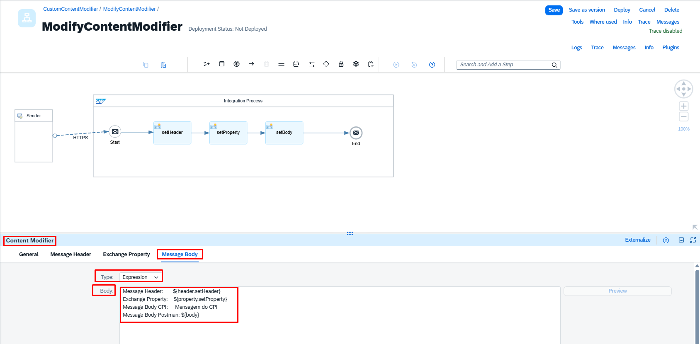

Em Header adicionamos
```
Message Header
create   -   CPI_Tenant   -    Expression   -    ${header.CamelHttpUrl}          - java.lang.String
```
<br>

### Configurando o Content Modifier - Property
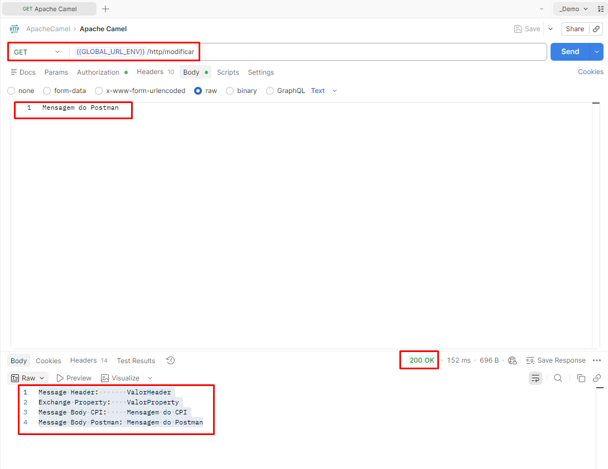

Em Property adicionamos
```
Exchange Property
create   -   Iflow_Name   -    Constant     -    NotificationEmail
create   -   Date_Now     -    Expression   -    ${date:now:yyyy-MM-dd HH:mm:ss}    - java.lang.String
```
<br>

### :six: End – Receiver

Nesta etapa, vamos utilizar o adapter de Email para que possamos realizar as conexões e configurações no adapter, para recebermos o e-mail da forma que queremos.

O retorno é recebido no formato HTML.


<br><br>

## 📦 Exemplo prático – iFlow para baixar

📦 [Download do iFlow – EmailNotification](https://github.com/souzajean/EmailNotification/raw/main/Package/CustomEmailNotification.zip)


> O arquivo pode ser importado diretamente no SAP Integration Suite (CPI).

